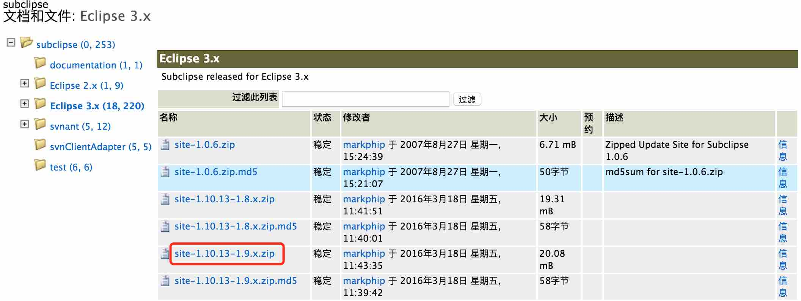

# Eclipse SVN

安装 Eclipse SVN 插件可以方便的在 Eclipse 内部使用 SVN 功能。

### Marketplace 下载

打开Eclipse --> Help --> Eclipse Marketplace --> 在Find中输入subclipse搜索 --> 找到subclipse点击install

### Install New Software 下载

打开Eclipse --> Help --> Install New Software --> 点击add按钮，输入下载地址：http://subclipse.tigris.org/update_1.10.x，点击OK

将Subclipse和SVNKit打勾后，一路next或agree到结束即可

### site zip 导入

zip 导入的话，我们首先要准备好 [svn 插件](http://subclipse.tigris.org/servlets/ProjectDocumentList?folderID=2240)。

选择交新的稳定版本下载。

#### 通过配置添加 site

打开 Eclipse ，从菜单进入 Help - Install New Software...

选中导入svn包。

勾选 svn 插件列表，点击 next。

#### 拷贝到文件添加 site

解压缩后在eclipse目录下找到dropins文件夹，进入dropins文件夹并新建一个文件夹名为svn，将features和plugins文件夹复制到svn目录下-->重启下Eclipse即可

### SVN 的使用

https://www.cnblogs.com/liangguangqiong/p/7965770.html
