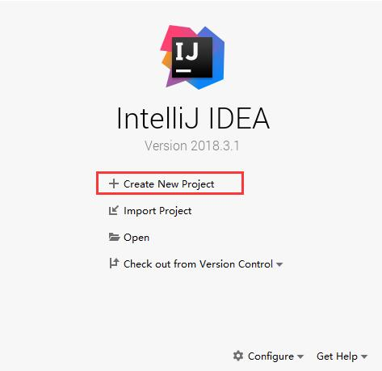
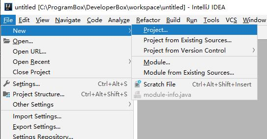
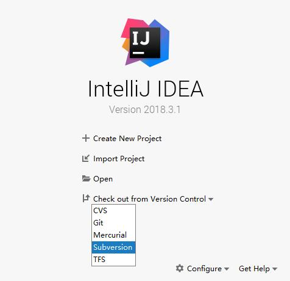
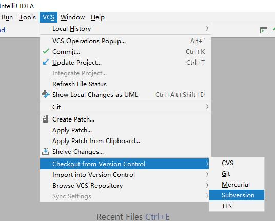
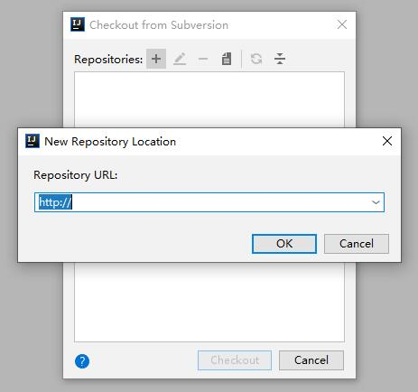

# IntelliJ IDEA

IntelliJ IDEA 分两个版本，一个是付费的，一个是免费的。同时支持 `Windows`，`macOS`，`Linux`。

### 下载

通过[官网地址](https://www.jetbrains.com/idea/download/#section=windows)，我们用 `Windows` 平台为例。

选择需要的版本下载运行并安装。

### 项目新建

项目新建既可以通过启动页新建，也可以通过菜单新建项目。

#### 启动页新建

启动页新建，点击 `Create New Project`。

#### 菜单新建

菜单新建，`File` -> `New` -> `Project...`

### SVN 使用

使用 SVN 时确保本地已经安装 [TortoiseSVN](https://ricebai.github.io/2018/05/07/tortoise-svn/)。

#### 检出项目1

启动页新建，点击 `Check out from Version Control` -> `Subversion`。

#### 检出项目2

菜单点击，`VCS` -> `Check out from Version Control` -> `Subversion`。

#### 添加地址

点 `+`，添加地址后点击`Checkout` 就行了。

### 快捷键

熟悉常用的快捷键能提高代码编写效率。

|快捷键| 说明|
| --- | --- |
|Shift+Enter|向下插入新行|
|Ctrl+Enter|向上插入新行|
|Ctrl+Shift+F|全局查找|
|Ctrl+Shift+R|全局替换文本|
|Ctrl+F|查找|
|Shift+F3，F3| 向上查找，向下查找|
|Ctrl+R|替换文本|
|Ctrl+G|定位行|
|Alt+Enter|代码提示，导入包，自动修正|
|Ctrl+Shift+U|大小写切换|
|Ctrl+E|最近的文件|
|Ctrl+Shift+E|最近更改的文件|
|Ctrl+Alt+S|打开设置|

更多设置可以参考